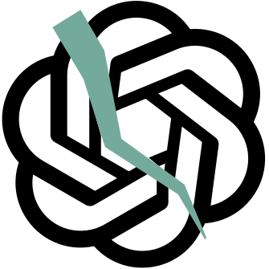

# AvantGarble - Dadaist chatbot

<p align="center">

</p>

---

Chat with the bot [here](https://place/holder).

## Context

In the early 20th century, a group of Italian and Swiss artist revolted by the
horrors of WWI started making art by rejecting traditional art values, such as
rationality, beauty and logic. They explored randomness and absurdity and pave
the way to conceptual and surreal art. Many artists explored with incorporating
randomness in the generation of their art.

One of the triumph of the current times is the development of smart chatbots,
the most famous of them being ChatGPT. These chatbots use the latest advances of
Artificial Intelligence (AI) to produce careful responses to any question from
the user. Dada artist that often displayed readymade pieces of art taking daily
objects and putting them out of context in an art gallery would probably love
the tools we have at our disposal.

This project is a rejection to the smartness and rational thinking of modern
chatbots by producing random (but English like) response to the users input. The
work democratizes the access to Dadaist art by giving a short dadaist text. It
also makes the viewer participate in the creation of the art by requiring its
input.

In a Dadaist move the name "AvantGarble" was chosen by
[ChatGPT](https://chat.openai.com/share/8cdf05a2-d521-4404-b2d4-6e4af7cd4434).


## History of the project

I being working on this idea for since Jan 2024. I made two previous versions.

The first proof of concept was client side only and used a dictionary of English
words to build the model. The language model was a 3 character trigrams taken
directly from the dictionary. The generate text was usually a gibberish of
letters that probably pass a letter frequency test for English but not much
more. Also spaces in the generated text were rare, so the output often had long
words. This was because a space was added to the end of each trigram but the
model hat no idea of its actual distribution in English text. The code and live
demo are available [here](https://github.com/tito21/AvantGarble)

The second version had a much nicer interface developed in React and the
language model was still a character based, but the trigrams now came from an
actual English corpus. The trigrams are stored as separate `.json` files in
[GitHub](https://github.com/tito21/ngrams-blogger). This meant that to generate
each token (one character) a full request was needed. I tried to store the model
in Google Cloud Object Storage and serve from there, but it was too expensive.
The code is available [here](https://github.com/tito21/avant-garble). The
generated text sometimes contained real words but was mostly gibberish. This
time spaces were distributed more like in English text and if you were just
looking at the text without reading it felt much more English, similar to Lorem
Ipsum.

This third incarnation uses word level trigrams generated from the same corpus
as the second version. These makes the generated text more like a random
connection of English words. The model behaves similarly to the prediction text
from your phone's keyboard. The generated text is still mostly nonsense, but it
contains real words and sometimes short common phrases. Also, the responses are
much faster because the model is stored locally in a Unix database.

## Build instructions and tech stack

### Install locally

First build the front end:

```bash
cd client
npm install
npm run build
```

The back end runs on Python using [FastAPI](https://fastapi.tiangolo.com/). To
manage dependencies the project uses [uv](https://docs.astral.sh/uv/), To run
activate the environment and then run `fastapi run .\main.py`

The front end is writing in React with Typescript and it is located in `client`.
The backend uses FastAPI to serve the client and the answers. The answers are
sent word by word to the client using websockets.

The answers are generated by a [n-gram language
model](https://en.wikipedia.org/wiki/Word_n-gram_language_model). The n-grams
come from the Blog Authorship Corpus and are stored on a Unix database.

The live version is hosted on Google Cloud Run. To deploy follow these
instructions:

1. Build and push the docker image:

```bash
docker build -t avant-garble-python .
docker push europe-west2-docker.pkg.dev/avant-garble/avant-garble/avant-garble
```

2. On the Google Cloud Console, go to Cloud Run and deploy a new revision of the
service `avant-garble-python` using the new image.
